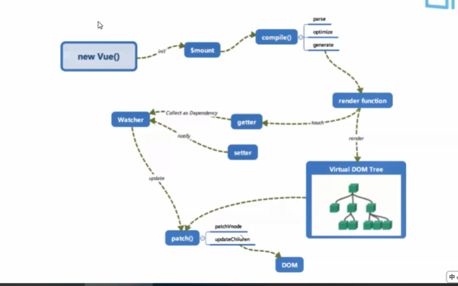

# Vue工作机制

## 初始化

### 在new Vue()之后， Vue调用进行初始化， 会初始化生命周期、事件、props、methods、data、computed、watch等，其中最重要就是通过

### Object.defineProperty() 设置getter,setter，用来实现【响应式】和【依赖收集】

### 初始化之后 ，调用$mount() 挂载组件

## Vue执行机制

### 1.new Vue()

- 1.1：初始化生命周期函数
- 1.2：初始化data
- 1.3：初始化props
- 1.4： methods
- 1.5： computed、watch
  
### 2.$mount()

- 1.1: 创建根组件，创建一个watcher
  